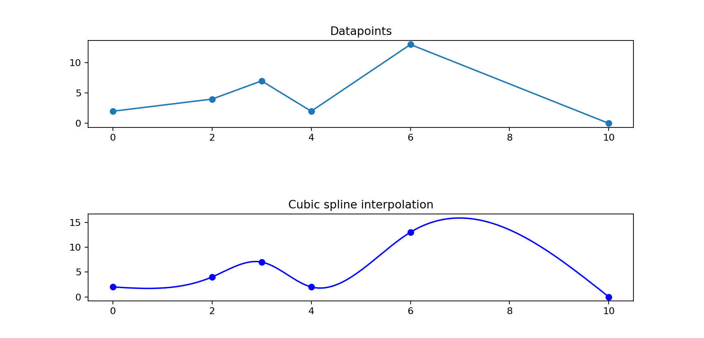

## nspline, a single header cubic spline interpolation C99 library
this is a port of: [ttk592/spline](https://github.com/ttk592/spline)
## example usage:
```
    #include <stdio.h>
    #include "nspline.h"
    int main(void) {
        //x values must be strictly increasing
        double xs[5] = {0.5, 1.0, 1.2,  2.0, 3.0}; 
        double ys[5] = {2.0, 5.0, 10.0, 3.0, 7.0};
        struct nspline ns;
        if (nspline_init(&ns, nsp_const_dview(xs, ys, 5)) != NSP_OK) {
            fprintf(stderr, "no mem?\n");
            return 1;
        }
        double want_x[3] = {0.33, 1.05, 2.3};
        for (int i=0; i<3; i++) {
            double x = want_x[i];
            double y = nspline_interpolate(&ns, x);
            printf("interpolation of x=%.2f: %.2f\n", x, y);
        }
        //free resources
        nspline_deinit(&ns); 
    }
```

